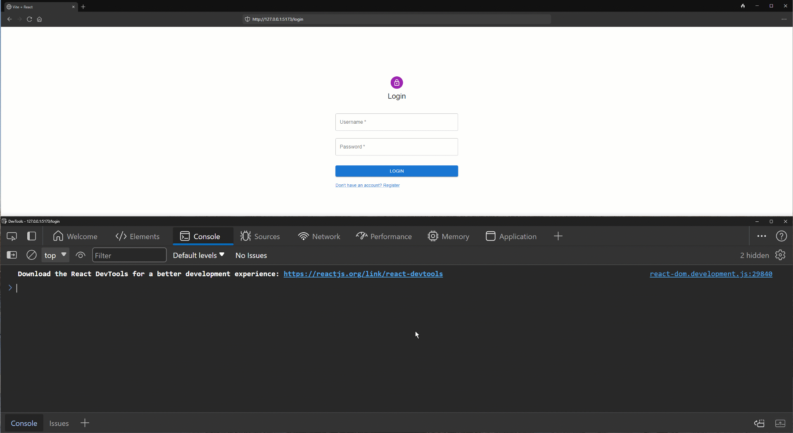

# Simple Frontend Login and Register Forms

## Video

## Description

The App displays Login and Register forms.
 
The forms' input is shown in the console.

## Installing and start up

Install dependencies by running the command npm install.
 
Start the program by running the command npm run dev in the terminal.

## Project details

This project is made with React+Vite and runs on localhost (http://127.0.0.1:5173/).

## Design decisions

The App is written using Hooks (New React).
 
The App is divided into components that use the router from the routes folder.
 
Styles are created with Material.ui.

## NB

There is no real functionality.

## Known errors

-
